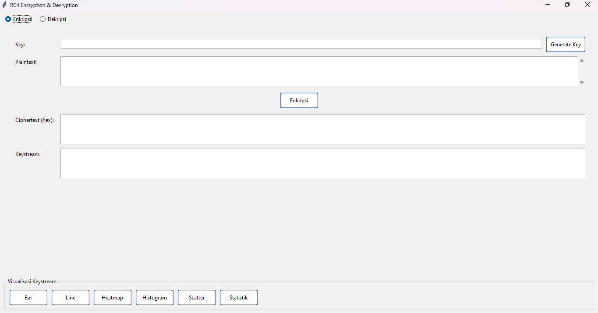
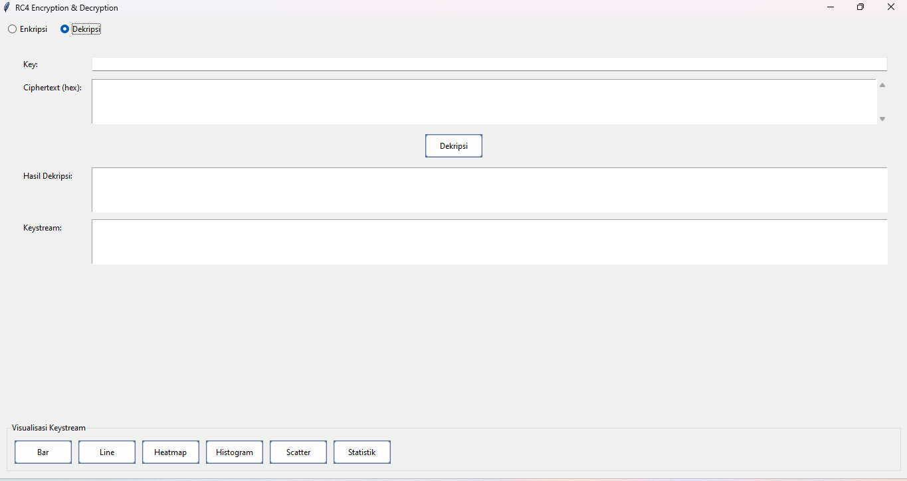
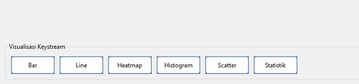

# 🔐 Simulasi RC4 dan Visualisasi Keystream
Aplikasi ini adalah alat bantu interaktif berbasis GUI (Tkinter) yang digunakan untuk mengenkripsi dan mendekripsi pesan menggunakan algoritma **RC4 (Rivest Cipher 4)** serta melakukan **visualisasi keystream** secara grafis. Aplikasi ini bertujuan untuk memberikan pemahaman mendalam mengenai mekanisme kerja stream cipher klasik dan karakteristik keystream-nya.

## ❓ Apa itu RC4?

**RC4 (Rivest Cipher 4)** adalah algoritma stream cipher yang dikembangkan oleh Ronald Rivest pada tahun 1987. RC4 bekerja dengan menghasilkan aliran byte pseudo-acak yang disebut **keystream**, yang kemudian di-**XOR** dengan plaintext (untuk enkripsi) atau ciphertext (untuk dekripsi).

RC4 dikenal karena:
- 🔹 Strukturnya yang sederhana
- 🔹 Prosesnya cepat
- 🔹 Pernah digunakan luas di protokol seperti **WEP**, **SSL**, dan **TLS**

Namun, RC4 **tidak lagi aman untuk aplikasi kriptografi modern** karena kelemahan dalam pembangkitan keystream awal. Meskipun demikian, RC4 tetap menjadi algoritma yang relevan untuk **pembelajaran konsep dasar stream cipher**.

---
## 👥 Anggota Kelompok
| Nama                    | NIM         |
|-------------------------|-------------|
| Lio Kusnata             | G1A023013   |
| Rahman Firdaus Ilahi    | G1A023055   |
| Abim Bintang Audio      | G1A023073   |
| Ajis Saputra Hidayah    | G1A023083   |

---
## 🧠 Algoritma dan Proses Enkripsi/Dekripsi

### RC4 Cipher
1. Pengguna memasukkan **plaintext** dan **kunci** dalam bentuk string.
2. Kunci dikonversi ke byte array untuk digunakan dalam proses KSA.
3. **Key Scheduling Algorithm (KSA)** membangkitkan array permutasi awal `S`.
4. **Pseudo-Random Generation Algorithm (PRGA)** menghasilkan keystream sepanjang plaintext.
5. Setiap byte plaintext di-XOR dengan byte keystream.
6. Hasil enkripsi ditampilkan dalam format **heksadesimal**.

### Proses Dekripsi
1. Pengguna memasukkan **ciphertext (hex)** dan **kunci**.
2. Ciphertext dikonversi kembali ke byte array.
3. Keystream dihasilkan ulang menggunakan KSA dan PRGA.
4. Ciphertext di-XOR dengan keystream untuk mendapatkan plaintext kembali.

## 📊 Fungsi Visualisasi Keystream

Setelah proses enkripsi/dekripsi berhasil, keystream dapat divisualisasikan melalui tombol-tombol berikut:

| Jenis Visualisasi | Fungsi |
|-------------------|--------|
| **Bar Chart**     | Menampilkan keystream sebagai batang per byte |
| **Line Chart**    | Grafik garis untuk melihat fluktuasi byte |
| **Heatmap**       | Peta panas distribusi byte keystream |
| **Histogram**     | Distribusi frekuensi nilai byte |
| **Scatter Plot**  | Sebaran nilai byte terhadap indeks |
| **Statistik**     | Informasi numerik: min, max, mean, std dev, jumlah unik |
| **Export**        | Simpan visualisasi (.png) dan statistik (.csv) |

---
## 🖥️ Tampilan Antarmuka
### 🔐 Halaman Enkripsi RC4

### 🔓 Halaman Dekripsi RC4

### 📊 Visualisasi Keystream


---
## ⚙️ Cara Menjalankan Aplikasi

### 1. Clone Repository
```bash
git clone https://github.com/[USERNAME]/Simulasi-RC4-Visualisasi.git

##✅ Fitur Lengkap

- **RC4 Encryption**: Enkripsi plaintext menjadi ciphertext dalam format hexadecimal.
- **RC4 Decryption**: Dekripsi ciphertext menjadi plaintext asli dengan kunci yang sama.
- **Keystream Generator**: Menggunakan proses KSA dan PRGA untuk menghasilkan keystream dinamis.
- **Keystream Visualization**: Menampilkan keystream secara visual untuk analisis lebih lanjut.
- **Bar Chart & Line Chart**: Melihat variasi dan distribusi byte keystream dalam bentuk grafik batang dan garis.
- **Heatmap & Histogram**: Analisis penyebaran dan frekuensi nilai byte keystream.
- **Scatter Plot**: Menampilkan sebaran byte keystream terhadap indeksnya.
- **Statistik Keystream**: Rata-rata, median, nilai maksimum/minimum, deviasi standar, dan jumlah byte unik.
- **Export Gambar**: Simpan hasil visualisasi keystream sebagai file gambar (.png).
- **Export Statistik**: Ekspor analisis keystream dalam format .csv.
- **Avalanche Effect Analysis**: Uji sensitivitas cipher terhadap perubahan kecil pada kunci.
- **GUI Interaktif**: Antarmuka berbasis Tkinter yang user-friendly dan mudah dipahami.
- **Real-time Analysis**: Proses enkripsi dan dekripsi dilakukan secara instan saat tombol diklik.
- **Responsif**: Aplikasi dapat menangani plaintext hingga 10.000 karakter dengan waktu respon < 0.1 detik.


